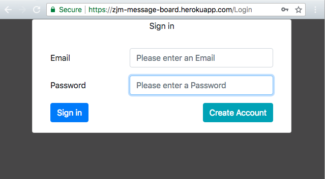

# Secret Message Board

> A Secret Message Board using React and Redux that allows users to post text items, delete, and comment on posts. Email sign up and login enabled. v.1.0.0



## Background

React is a JavaScript library for building user interfaces. Firebase is used on the backend. The Firebase Realtime Database is a cloud-hosted database with data stored as JSON and synchronized in realtime.

## Installation

Download all associated files and load them up in your favorite text editor!

## Development setup

```
npm install
```

```
npm run build
```

```
npm start
```

## Contributing

- Please follow the AirBnB styleguide.

- Open a pull request, all contributions will be considered.

## Notes

### Next version to have:

- ability to post links and upload photos.
- sign in button moved to the right.
- accessibility (ADA)

## Contact Information

Twitter: [@adriftinthesea](https://twitter.com/adriftinthesea)

Email: z@zamarise.com

GitHub: [https://github.com/zamarise](https://github.com/zamarise/)

## Acknowledgments

- I followed [Taylor Ray Howard's tutorial](https://www.youtube.com/playlist?list=PLfU58NU1ve6qwKQd7AGLZsDZ_H0DPqNx8).
